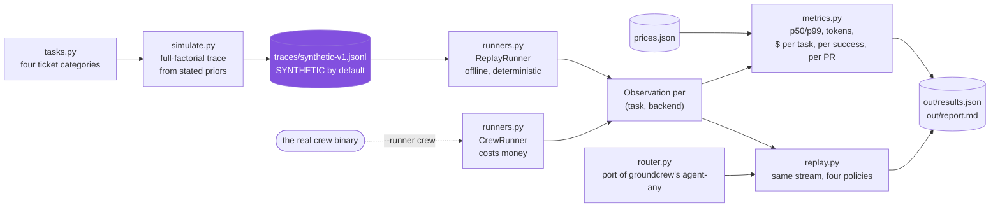

# crewbench

**Every number this repo prints by default is `SYNTHETIC`.** See "Synthetic by default"
below before you quote anything from it.

A per-task, per-backend benchmark for [groundcrew](https://github.com/ClipboardHealth/groundcrew)'s
`agent-any` router, plus a counterfactual replay that prices the routing decision itself.

---

## The short version

**What I noticed.** groundcrew hands engineering tickets to a coding agent and lets it open
the PR. Its `agent-any` router chooses between Claude and Codex on one signal, how much
session quota is left, and the repository publishes no cost, latency or success figures to
check that choice against. So the decision is a fuel gauge, and nobody can say whether that
costs anything.

**Why I built it.** To find out whether the heuristic is leaving money on the table, and to
give the decision a measured basis if it is.

**How.** I ported `pickBestAgent` and its gates to Python and conformance-tested the port
**16 out of 16 against groundcrew's own `eligibility.test.ts` and `dispatcher.test.ts`**, so
the baseline row is their logic rather than my reading of it. Then I replayed the same
200-task stream through four routing policies under the same session and weekly gates.

**What I found.** Measured routing barely beats the heuristic, and the margin costs more to
learn than it returns:

| policy | dispatched | skipped by the gate | success | $/PR |
|---|---:|---:|---:|---:|
| headroom (theirs) | 150 | 0 | 82.0% | $4.46 |
| measured success-per-dollar | 150 | 0 | **82.7%** | $4.40 |
| claude only | 93 | **57** | 80.6% | $4.39 |
| codex only | 84 | **66** | 76.2% | $4.52 |

The single-backend policies look cheapest on total spend, $267 and $230 against $432, but
only because the gate skipped 57 and 66 tasks. That is why `dispatched` and `skipped` sit in
the same table as the rates.

The more useful result is how much it costs to learn that 0.7 point edge:

| calibration tasks | sessions burned | categories ranked correctly |
|---:|---:|---:|
| 10 | 20 | 1 of 4 |
| 25 | 50 | 3 of 4 |
| **50** | **100** | **4 of 4** |

The preference table only stabilises after 50 paired tasks, which is 100 sessions of real
spend on both backends. **Paying 100 sessions to gain 0.7 points is a bad trade, so the
headroom heuristic is the correct default** until someone has a reason to think the ranking
has shifted. This harness is the tripwire for that moment, not a replacement for the router.

**One thing that is not simulated at all.** Reading the code, `status` records wall clock and
PR outcomes but carries **no token or cost field anywhere**, so cost per ticket is not
computable today. That gap is why `--token-probe` exists below, and it now has a fix open
upstream: [ClipboardHealth/groundcrew#379](https://github.com/ClipboardHealth/groundcrew/pull/379).

**What it is not.** Every performance number above is `SYNTHETIC`, replayed from invented
priors rather than measured from real runs. The ranking of Claude against Codex is a property
of those priors and is not evidence about either. What is real is the router port and its
16 passing conformance tests. Swap in observations with `--runner crew`.

## Why

groundcrew's `agent-any` label routes on exactly one signal. From
`src/commands/eligibility.ts` at `32346b9`:

```ts
const scored = candidates.map((name) => ({ name, score: usage[name]?.session ?? 0 }));
```

Session-window headroom, ties broken toward `agents.default`, with agents skipped when
they exceed `sessionLimitPercentage` (default 85) or the weekly paced budget. That is a
budget heuristic, and a good one: it is cheap, it fails closed when `codexbar` can't be
read, and it directly implements the reason Rocky Warren gives for running two backends
at all ("Running both also keeps us under rate limits").

What it is not is a measured decision. There is no cost term, no latency term, no success
term, and no per-task-type term, because groundcrew records none of those. `RunState`
stores `agent`/`state`/`createdAt`/`updatedAt`; `LocalStatusDocument` stores `lifecycle`
and `startedAt`; PRs arrive keyed by worktree dir. Wall clock and PR-rate are already
derivable from what ships. **Tokens and dollars are recorded nowhere.**

crewbench is the table that decision would need.

## How a run is put together



`router.py` is a port of groundcrew's own eligibility logic rather than a
paraphrase, which is what makes the replay a counterfactual against their real
policy instead of against a strawman.

## What it measures

Per backend and per task category: task success rate, PR-rate, p50/p99 wall clock,
tokens per task, $ per task, $ per success, $ per PR.

Then it replays the same task stream through four routing policies under identical
session and weekly gates:

| policy | what it does |
|---|---|
| `headroom` | line-by-line port of groundcrew's `pickBestAgent` + `classifyUsageExhaustion` |
| `claude-only` / `codex-only` | single-backend baselines |
| `measured` | routes on measured success-per-dollar per category, fitted on a held-out calibration prefix, falling back to `headroom` when a backend is gated |

The port is conformance-tested against groundcrew's own `eligibility.test.ts` and
`dispatcher.test.ts` cases, so the baseline in the table is their router and not a
paraphrase of it.

## Run it

```bash
uv venv --python 3.12 .venv          # stdlib only, no dependencies
.venv/bin/python tests/test_router_conformance.py
.venv/bin/python -m crewbench.bench run
```

Output goes to `out/report.md` and `out/results.json`. Deterministic for a given `--seed`.

Useful flags: `--tasks`, `--seed`, `--calibration-fraction`, `--default-agent`,
`--session-capacity`, `--weekly-capacity`, `--prices`.

## Synthetic by default

The default runner replays `traces/synthetic-v1.jsonl`, generated by
`crewbench/simulate.py`. It runs offline and spends nothing.

Every record in that trace carries `"synthetic": true`. The reporter ORs that flag across
the run and stamps `SYNTHETIC` on the report title, on every table, and in a closing
warning. The label is produced by code, so a simulated figure cannot be printed unlabelled
even by accident. Feed it a trace of real observations and the same tables come back
stamped `MEASURED`.

**The priors are invented.** The only public statement about relative backend skill in the
whole groundcrew corpus is one qualitative sentence: *"I've found Codex is the better
debugger and reviewer, and Claude Code is the better designer."* Mapping that onto four
task categories is a guess, and the deltas are made up. The per-backend ranking the default
run prints is therefore a property of `simulate.py`, **not evidence about Claude Code or
Codex.** Read `simulate.py` before reading `out/report.md`.

Token magnitudes are fitted so the trace's tokens-per-PR matches the ~6.3M implied by
"9.5B tokens a month" and "50+ PRs a day". That is a calibration input, so its agreement
proves nothing; the report says so in the same table. The blended $/Mtok figure is *not*
fitted, and lands at $0.697 against the $0.737 those two aggregates imply.

## Swapping in the real `crew` binary

One flag:

```bash
.venv/bin/python -m crewbench.bench run --runner crew --source linear \
  --token-probe 'your-token-reader --json'
```

`CrewRunner` (in `crewbench/runners.py`) then does, per task:

1. `crew start <TASK>`
2. poll `crew status --json --local-only` until the task's `lifecycle` leaves
   running/provisioning or its `session` stops being live
3. wall clock = `updatedAt - startedAt` from that document (groundcrew stores instants,
   never durations, deliberately; the reader subtracts)
4. `crew status --json` once, and look the worktree dir up in
   `payload.pullRequestsByWorktree` for `pr_opened`

**This path has never been executed.** It costs real quota on your own plan, so it was
written against groundcrew's status-document types and shipped unrun. Treat it as a
starting point, not a tested integration.

**And it has one genuine gap.** groundcrew emits no token or cost field anywhere, so
`--token-probe` is a shell command you supply that prints
`{"input_tokens":…,"cached_input_tokens":…,"output_tokens":…}` for the finished session.
Without it the dollar columns come back zero and the report says zero rather than guessing.
If groundcrew's run state carried per-run token counts, this probe would not be needed and
the whole benchmark would fall out of what groundcrew already writes.

**That gap now has a fix upstream:**
[ClipboardHealth/groundcrew#379](https://github.com/ClipboardHealth/groundcrew/pull/379).

Finding it here is what prompted the PR. It turns out the numbers were already free: Claude
writes a JSONL transcript per session with `usage` stamped on every assistant message, so
the `SessionEnd` hook groundcrew already installs can read it. No API call, no provider
lookup, no second run. The counts land on `RunState.usage`, beside the wall clock and pull
request outcome `status` already tracks.

Two things that decide whether that number is trustworthy, both worth knowing if you write
your own probe against these transcripts:

- **Deduplicate by `message.id`.** A transcript repeats the same assistant message. On a
  real one, 718 records carried usage but only 327 ids were distinct, and summing every
  record inflated the total **2.13x**. The inflation is not uniform across fields (2.10x on
  cache reads against 2.64x on output), so it distorts the input/output mix as well as the
  total and cannot be corrected with a constant afterwards. The PR collapses to the highest
  value per field per id, which is also correct if a version writes cumulative snapshots
  rather than exact repeats.
- **Keep cache reads separate from fresh input.** They bill roughly ten times apart, so a
  single total prices a cache-heavy session as though nothing were cached.

If that lands, `--token-probe` becomes unnecessary for Claude sessions and the dollar
columns fill themselves in.

Counterfactual replay needs a **full-factorial** trace: every task observed on every
backend. That doubles the spend and is the honest price of being able to compare routing
policies at all. A single-arm trace still gives you every table in part 1.

## Layout

```
crewbench/router.py     port of groundcrew's routing + gates, and the policies
crewbench/replay.py     usage-timeline replay, calibration fitting
crewbench/runners.py    Runner protocol; ReplayRunner (default), CrewRunner (real)
crewbench/simulate.py   the synthetic trace generator, and its priors
crewbench/metrics.py    percentiles, three-way token pricing, aggregation
crewbench/tasks.py      the task suite
crewbench/bench.py      CLI and reporting
tests/                  conformance against groundcrew's own test cases
prices.json             PLACEHOLDER rates; set your own before believing any dollar
traces/                 the shipped SYNTHETIC trace
```

MIT-compatible use; groundcrew itself is MIT.
